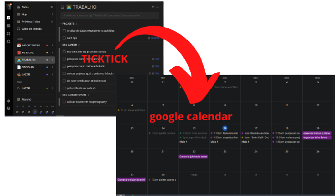

<h3 align="center">
  TICKTICK GCAL SYNC
</h3>

  
  
   
  
  
  

  <a href="#dart-features">Features</a> • <a href="#books-about">About</a> • <a href="#family-community">Community</a>

## :trumpet: Overview

a solution to add an one way synchronization from <a href="https://ticktick.com/">ticktick</a> to <a href="https://calendar.google.com/">google calendar</a> with some customizations.

  

## :dart: Features

&nbsp;&nbsp;&nbsp;✔️ add ticktick tasks to google calendar; 
&nbsp;&nbsp;&nbsp;✔️ update ticktick tasks in  its corresponding event in gcal agenda in case of changes in dates, description and title; 
&nbsp;&nbsp;&nbsp;✔️ every completed task in ticktick will make the task be moved to a compelted gcal agenda; 
&nbsp;&nbsp;&nbsp;✔️ option to send a daily summary notification of what tiktok has done throughout the day; 
&nbsp;&nbsp;&nbsp;✔️ option to sync each ticktick calendar to a different google calendar agenda;
&nbsp;&nbsp;&nbsp;✔️ option to ignore certain tasks based on tags present in its title. 

## :books: About

## License

This project is distributed under the terms of the MIT License Version 2.0. A complete version of the license is available in the [LICENSE](LICENSE) file in this repository. Any contribution made to this project will be licensed under the MIT License Version 2.0.

## :family: Community

## Contributing

If you are a typescript developer, we would kind and happy accept your help:

- The best way to get started is to select any issue from the [`good-first-issue`](https://github.com/lucasvtiradentes/ticktick-gcal-sync/labels/good%20first%20issue) label;
- If you would like to contribute, please review our [Contributing Guide](docs/CONTRIBUTING.md) for all relevant details.

Another ways to positivily impact this project is to:

- **:star: Star this repository**: my goal is to impact the maximum number of developers around the world;
- ✍️ **Fix english mistakes** I might have made in this project, may it be in the DOCS or even in the code (I'm a portuguese natural speaker);
- [:heart: Say thanks](https://saythanks.io/to/lucasvtiradentes): kind words have a huge impact in anyone's life;
- [💰 Donate](https://github.com/lucasvtiradentes): if you want to support my work even more, consider make a small donation. I would be really happy!

## Feedback

Any questions or suggestions? You are welcome to discuss it on:

- [Github issues](https://github.com/lucasvtiradentes/ticktick-gcal-sync/issues)
- [Email](mailto:lucasvtiradentes@gmail.com)

## Acknowledgements

This project is an idea of [@lucasvtiradentes](https://github.com/lucasvtiradentes) to `return some value to the world` after years of consuming a lot of useful tools provided by this `amazing open source community`.

  

    
    
    
    
  

  
Made with ❤️ by Lucas Vieira.

  
👉 See also all <a href="https://github.com/lucasvtiradentes/lucasvtiradentes/blob/master/portfolio/PROJECTS.md#TOC">my projects</a>

  
👉 See also all <a href="https://github.com/lucasvtiradentes/my-tutorials#readme">my articles</a>

