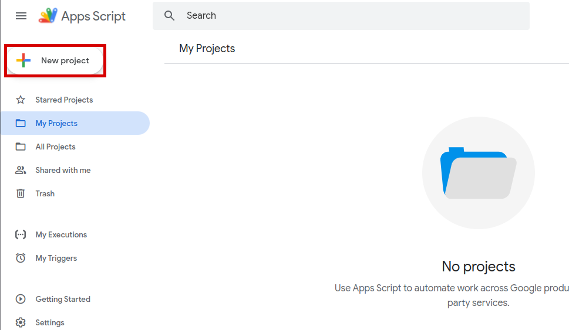
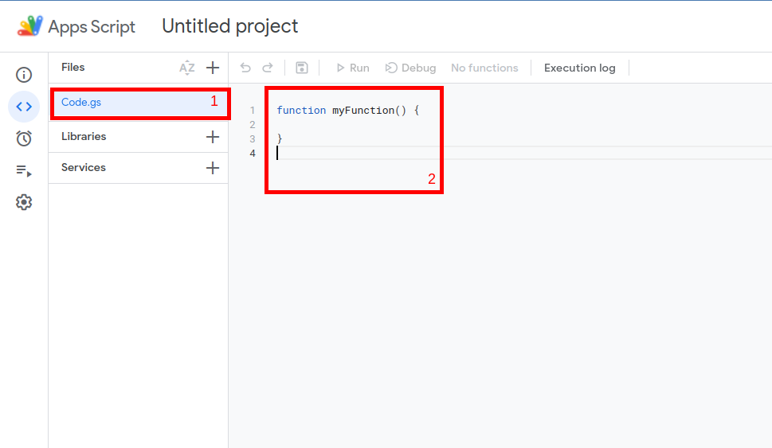
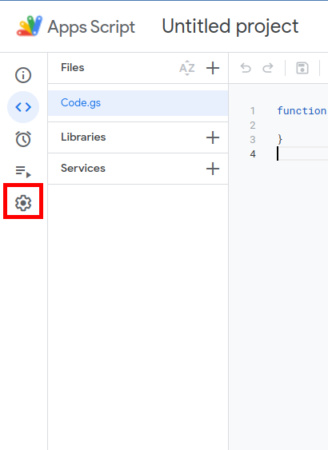
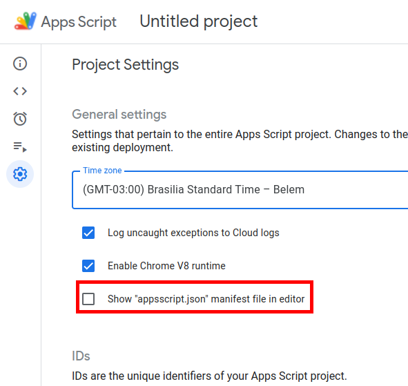
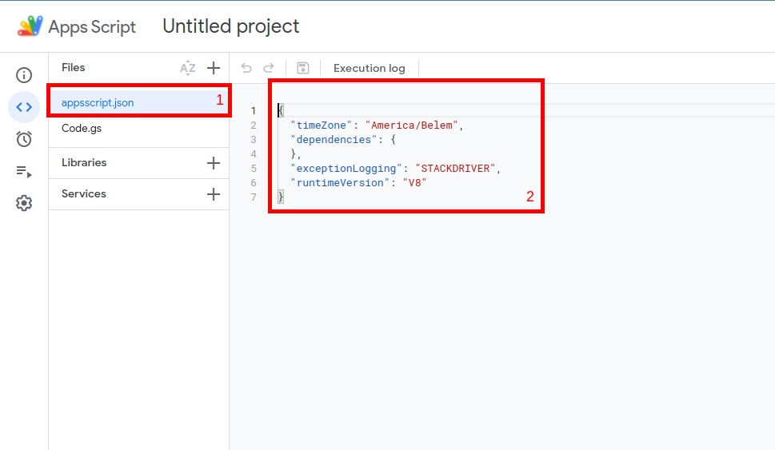
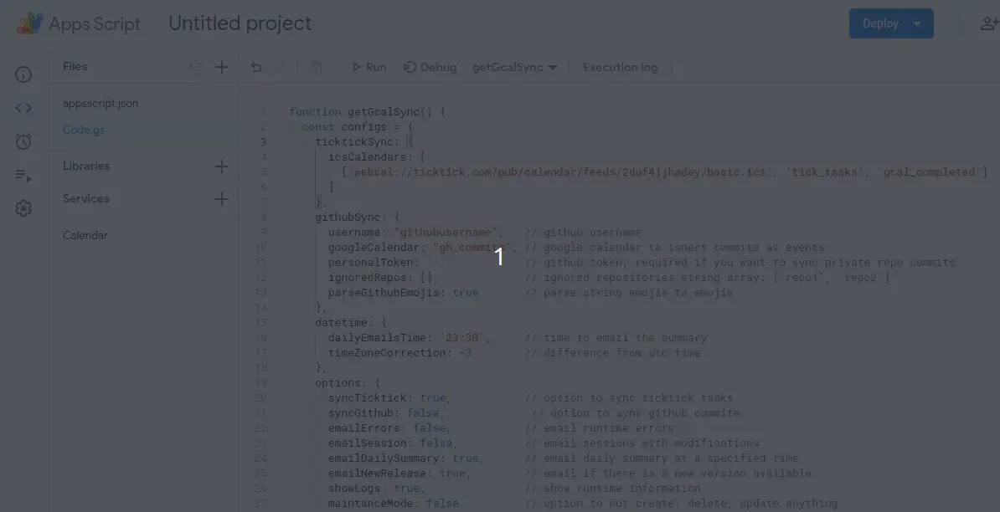

<a name="TOC"></a>

<h3 align="center">
  GCAL SYNC
</h3>

<div align="center">
  <a href="https://www.npmjs.com/package/gcal-sync"></a>
  <a href="https://nodejs.org/en/"></a>
  <a href="https://github.com/lucasvtiradentes/gcal-sync#contributing"></a>
  <br>
  <a href="https://github.com/semantic-release/semantic-release"></a>
  <a href="https://gitmoji.dev"></a>
</div>

<p align="center">
  <a href="#dart-features">Features</a> • <a href="#warning-requirements">Requirements</a> • <a href="#bulb-usage">Usage</a> • <a href="#wrench-development">Development</a> • <a href="#books-about">About</a> • <a href="#family-community">Community</a>
</p>

<details>
  <summary align="center"><span>see <b>table of content</b></span></summary>
  <p align="center">
    <ul>
      <!-- <li><a href="#trumpet-overview">Overview</a></li> -->
      <!-- <li><a href="#pushpin-table-of-contents">TOC</a></li> -->
      <li><a href="#dart-features">Features</a></li>
      <li><a href="#warning-requirements">Requirements</a></li>
      <li>
        <a href="#bulb-usage">Usage</a>
        <ul>
          <li><a href="#installation">Installation</a></li>
          <li><a href="#general-tips">General tips</a></li>
        </ul>
      </li>
      <li>
        <a href="#wrench-development">Development</a>
        <ul>
          <li><a href="#development-setup">Development setup</a></li>
          <li><a href="#used-technologies">Used technologies</a></li>
        </ul>
      </li>
      <li>
        <a href="#books-about">About</a>
        <ul>
          <li><a href="#related">Related</a></li>
          <li><a href="#license">License</a></li>
        </ul>
      </li>
      <li>
        <a href="#family-community">Community</a>
        <ul>
          <li><a href="#contributing">Contributing</a></li>
          <li><a href="#feedback">Feedback</a></li>
        </ul>
      </li>
    </ul>
  </p>
</details>

<a href="#"></a>

## :trumpet: Overview

<div align="center">
  <table>
    <tr>
      <td width="250">
        
      </td>
      <td align="left">
        <p>Track your progress over time with an one way synchronization from <a href="https://ticktick.com/">ticktick</a> tasks and <a href="https://github.com/">github</a> commits to your <a href="https://calendar.google.com/">google calendar</a>.</p>
        <p>In the image it is shown my current usage of this tool:
          <ul align="left">
            <li align="left"><b>black</b>: my past github commits;</li>
            <li align="left"><b>green</b>: ticktick completed tasks;</li>
            <li align="left">the others collors are for ticktick tasks to do:
              <ul>
                <li><b>red</b>: important tasks with pre-defined datetime;</li>
                <li><b>blue</b>: planned tasks;</li>
                <li><b>purple</b>: not tasks (games to watch, movie release dates, etc).</li>
              </ul>
            </li>
          </ul>
        </p>
        <p>This project was deeply inspired by <a href="https://github.com/derekantrican/GAS-ICS-Sync">this tool</a>, and my main reason for creating this was to track my progress over my completed ticktick tasks, moving them to another calendar, which was not possible in the mentioned project.</p>
      </td>
    </tr>
  </table>
</div>

## :dart: Features<a href="#TOC"></a>

&nbsp;&nbsp;&nbsp;✔️ sync your ticktick tasks to google calendar;<br>
&nbsp;&nbsp;&nbsp;✔️ sync your github commits to google calendar;<br>
&nbsp;&nbsp;&nbsp;✔️ every completed task in ticktick will be moved to its corresponding completed google calendar;<br>
&nbsp;&nbsp;&nbsp;✔️ updates corresponding google calendar event in case of changes in ticktick task date or title;<br>
&nbsp;&nbsp;&nbsp;✔️ option to send a daily summary notification of what gcalsync has done throughout the day;<br>
&nbsp;&nbsp;&nbsp;✔️ option to sync each ticktick list to a different google calendar agenda;<br>
&nbsp;&nbsp;&nbsp;✔️ option to ignore certain tasks based on tags;<br>
&nbsp;&nbsp;&nbsp;✔️ you can add a url link to run the sync function manually whenever you want.<br>

## :warning: Requirements<a href="#TOC"></a>

The only thing you need to use this solution is a `gmail/google account`.

## :bulb: Usage<a href="#TOC"></a>

### Installation

To effectively use this project, do the following steps:

<details>
  <summary>1 - setup the ticktick ics calendars</summary>
  <div>
    <br>
    <p>Go to <a href="https://ticktick.com/webapp/#settings/subscribe">this page</a> and create as many ics calendars as you want to sync. You can create a ics calendar to sync everything, or one calendar per list.<br>
    Leave this browser tab open because you'll need the ics links in the next steps.
    </p>
    <p align="center"></p>
  </div>
</details>

<details>
  <summary>2 - create a Google Apps Scripts (GAS) project</summary>
  <div>
    <br>
    <p>Go to the <a href="">google apps script</a> and create a new project by clicking in the button showed in the next image.<br>
    It would be a good idea to rename the project to something like "gcal-sync".</p>
    <p align="center"></p>
  </div>
</details>

<details>
  <summary>3 - setup the gcal-sync on GAS</summary>
  <div>
    <br>
    <p>Click on the initial file, which is the <b>rectangle-1</b> on the image.</p>
    <p align="center"></p>
    <p>Replace the initial content present in the <b>rectangle-2</b> with the gcal-sync code provided bellow.</p>
    <blockquote>
      <p><span>⚠️ Warning</span><br>
       Remember to update the <code>configs</code> object according to your data and needs.</p>
    </blockquote>
    <pre>
function getConfigs() {
  const configs = {
    ticktickSync: {
      icsCalendars: [
        ['webcal://icscal1.ics', 'gcal_1', 'gcal_completed'],                             // everything will be synced
        ['webcal://icscal2.ics', 'gcal_2', 'gcal_completed', { tag: '#FUN' }],            // everything will be synced, but marks all tasks with a label
        ['webcal://icscal3.ics', 'gcal_all', 'gcal_completed', { ignoredTags: ['#FUN'] }] // everything will be synced, excepts tasks with the specifieds labels
      ]
    },
    githubSync: {
      username: "githubusername",   // github username
      googleCalendar: "gh_commits", // google calendar to isnert commits as events
      personalToken: '',            // github token, required if you want to sync private repo commits
      ignoredRepos: [],             // ignored repositories string array: ['repo1', 'repo2']
      parseGithubEmojis: true       // parse string emojis to emojis
    },
    datetime: {
      dailyEmailsTime: '23:30',     // time to email the summary
      timeZoneCorrection: -3        // difference from utc time
    },
    options: {
      syncTicktick: true,           // option to sync ticktick tasks
      syncGithub: true,             // option to sync github commits
      emailErrors: false,           // email runtime errors
      emailSession: false,          // email sessions with modifications
      emailDailySummary: true,      // email daily summary at a specified time
      emailNewRelease: true,        // email if there is a new version available
      showLogs: true,               // show runtime information
      maintanceMode: false          // option to not create, delete, update anything
    },
    settings: {
      syncFunction: 'sync',         // function name to run every x minutes
      updateFrequency: 5            // wait time between sync checks
    }
  }
  return config
}
function getGcalSync(){
  const version = "1.7.1" // version
  const gcalSyncContent = UrlFetchApp.fetch(`https://cdn.jsdelivr.net/npm/gcal-sync@${version}`).getContentText();
  eval(`this.GcalSync = ` + gcalSyncContent);
  const configs = getConfigs()
  const gcalSync = new GcalSync(configs);
  return gcalSync;
}
function setup() {
  const gcalSync = getGcalSync();
  gcalSync.installGcalSync();
}
function remove() {
  const gcalSync = getGcalSync();
  gcalSync.uninstallGcalSync();
}
function sync(){
  let gcalSync;
  try{
    gcalSync = getGcalSync()
    gcalSync.sync()
  } catch(e){
    if (gcalSync){
      gcalSync.sendErrorEmail(e.message)
    }
  }
}
function doGet(e) {
  let response = {}
  try{
    const gcalSync = getGcalSync()
    const content = gcalSync.sync()
    const logs = gcalSync.SESSION_LOGS
    response = {...content, logs}
  } catch(e){
    response = {error: e.message}
  }
  return ContentService.createTextOutput(JSON.stringify(response)).setMimeType(ContentService.MimeType.JSON)
}</pre>
  </div>
</details>

<details>
  <summary>4 - allow the required google permissions</summary>
  <div>
    <br>
    <p>Go to the project settings by clicking on the <b>first image rectangle</b>. After that, check the option to show the <code>appsscript.json</code> in our project, a file that manages the required google api access.</p>
    <div align="center">
      <table>
        <tr>
          <td width="400">
            
          </td>
          <td width="400">
            
          </td>
        </tr>
      </table>
    </div>
    <p>Go back to the project files, and replace the content present in the <code>appsscript.json</code> with the following code:</p>    <p align="center"></p>
    <pre>
{
  "timeZone": "Etc/GMT",
  "dependencies": {
    "enabledAdvancedServices": [
      {
        "userSymbol": "Calendar",
        "serviceId": "calendar",
        "version": "v3"
      }
    ]
  },
  "oauthScopes": [
    "https://www.googleapis.com/auth/script.scriptapp",
    "https://www.googleapis.com/auth/script.external_request",
    "https://www.googleapis.com/auth/script.send_mail",
    "https://www.googleapis.com/auth/userinfo.email",
    "https://www.googleapis.com/auth/calendar"
  ],
  "exceptionLogging": "STACKDRIVER",
  "runtimeVersion": "V8",
  "webapp": {
    "executeAs": "USER_DEPLOYING",
    "access": "ANYONE_ANONYMOUS"
  }
}</pre>
  </div>
</details>

<details>
  <summary>6 - setup the gcal-sync to run automatically every x minutes</summary>
  <div>
    <br>
    <p>Just follow what the bellow image shows, which is to select the <code>setup</code> function and run it.<br>
    After, a popup will appear asking your permission, and you'll have to accept it.</p>
    <p align="center"></p>
  </div>
</details>

<details>
  <summary>7 - deploy an api to manually run the sync function (optional)</summary>
  <div>
    <br>
    <p>It will allow you to sync whenever you go to a generated link.<br>
    Just do as the image shows.</p>
    <p align="center"></p>
  </div>
</details>

### General tips

- to use a newer version of gcal-sync, you just have to update the version number in the code;
- in case of deleted ticktick tasks (that means, you dont intend to do it anymore) that are in gcal, make sure to delete in gcal as well. If not, they will be moved to its corresponding completed calendar;
- before setting up the auto sync, you can use the `maintanceMode` to check if everything is okay by reading the app logs;
- it is not necessary to generate a github token in order to sync commits, it is only required if you want to sync your contributions to private repos as well;
- every update in ticktick may take 5 minutes to propagate to its ics calendars;
- if you dont want the sync anymore, you can remove its automation by running the <code>remove</code> function in the GAS project.

## :wrench: Development<a href="#TOC"></a>

### Development setup

<details>
  <summary align="center">Instructions for development setup</summary>
  <div>
<br>
To setup this project in your computer, run the following commands:

```bash
# Clone this repository
$ git clone https://github.com/lucasvtiradentes/gcal-sync

# Go into the repository
$ cd gcal-sync
```

After download it, go to the project folder and run these commands:

```bash
# Install dependencies
$ npm install
```

If you want to contribute to the project, fork the project, make the necessary changes, and to test your work you can load your version in apps scripts with almost no effort: replace the content of the <code>getGcalSync</code> with the following code to the apps script:

```js
function getGcalSync(){
  const configs = getConfigs()
  const version = "1.7.1" // version
  // const gcalSyncContent = getGcalSyncProduction(version)
  const gcalSyncContent = getGcalSyncDevelopment('yourgithub/gcalsync-fork', 'develop')
  eval(`this.GcalSync = ` + gcalSyncContent);
  const gcalSync = new GcalSync(configs)
  return gcalSync
}

function getGcalSyncProduction(version){
  return UrlFetchApp.fetch(`https://cdn.jsdelivr.net/npm/gcal-sync@${version}`).getContentText()
}

function getGcalSyncDevelopment(repository, branch){
  const filePath = "dist/GcalSync.min.js"
  const final_link = `https://api.github.com/repos/${repository}/contents/${filePath}${branch ? `?ref=${branch}` : ''}`
  const response = UrlFetchApp.fetch(final_link, {'method' : 'get', 'contentType': 'application/json'})
  const base64Content = JSON.parse(response.toString()).content
  const decodedArr = Utilities.base64Decode(base64Content);
  const decodedAsString = Utilities.newBlob(decodedArr).getDataAsString()
  return decodedAsString
}
```

This will make you be able to change the loaded gcal-sync version.
  </div>
</details>


### Used technologies

This project uses the following thechnologies:

<div align="center">
  <table>
    <tr>
      <th>Scope</th>
      <th>Subject</th>
      <th>Technologies</th>
    </tr>
    <tr>
      <td rowspan="1">Main</td>
      <td>Main</td>
      <td align="center">
        <a href="https://nodejs.org/"></a>
        <a href="https://www.typescriptlang.org/"></a>
      </td>
    </tr>
    <tr>
      <td rowspan="3">Setup</td>
      <td>Code linting</td>
      <td align="center">
        <a href="https://github.com/prettier/prettier"></a>
        <a href="https://github.com/eslint/eslint"></a>
      </td>
    </tr>
    <tr>
      <!-- <td rowspan="2">Setup</td> -->
      <td>Commit linting</td>
      <td align="center">
      <a target="_blank" href="https://github.com/conventional-changelog/commitlint"></a>
      <a target="_blank" href="https://github.com/commitizen/cz-cli"></a>
      <a href="https://gitmoji.dev"></a>
      </td>
    </tr>
    <tr>
      <!-- <td rowspan="2">Setup</td> -->
      <td>Other</td>
      <td align="center">
        <a href="https://editorconfig.org/"></a>
        <a target="_blank" href="https://github.com/typicode/husky"></a>
        <a target="_blank" href="https://github.com/okonet/lint-staged"></a>
      </td>
    </tr>
  </table>
</div>

<a href="#"></a>

## :books: About<a href="#TOC"></a>

## Related

The most related links to this project are:

- [GAS-ICS-Sync](https://github.com/derekantrican/GAS-ICS-Sync): A Google Apps Script for syncing ICS/ICAL files faster than the current Google Calendar speed. This was my main inspiration;
- [online-ics](https://larrybolt.github.io/online-ics-feed-viewer/): online tool to view ICS calendars;

## License

This project is distributed under the terms of the MIT License Version 2.0. A complete version of the license is available in the [LICENSE](LICENSE) file in this repository. Any contribution made to this project will be licensed under the MIT License Version 2.0.

<a href="#"></a>

## :family: Community<a href="#TOC"></a>

## Contributing

If you are a typescript developer, we would kind and happy accept your help:

- The best way to get started is to select any issue from the [`good-first-issue`](https://github.com/lucasvtiradentes/gcal-sync/issues) label;
- If you would like to contribute, please review our [Contributing guide](docs/CONTRIBUTING.md) for all relevant details.

Another ways to positivily impact this project is to:

- **:star: Star this repository**: my goal is to impact the maximum number of developers around the world;
- ✍️ **Fix english mistakes** I might have made in this project, may it be in the DOCS or even in the code (I'm a portuguese natural speaker);
- [:heart: Say thanks](https://saythanks.io/to/lucasvtiradentes): kind words have a huge impact in anyone's life;
- [💰 Donate](https://github.com/sponsors/lucasvtiradentes): if you want to support my work even more, consider make a small donation. I would be really happy!

## Feedback

Any questions or suggestions? You are welcome to discuss it on:

- [Github issues](https://github.com/lucasvtiradentes/gcal-sync/issues)
- [Email](mailto:lucasvtiradentes@gmail.com)

<a href="#"></a>

<div align="center">
  <p>
    <a target="_blank" href="https://www.linkedin.com/in/lucasvtiradentes/"></a>
    <a target="_blank" href="mailto:lucasvtiradentes@gmail.com"></a>
    <a target="_blank" href="https://discord.com/users/262326726892191744"></a>
    <a target="_blank" href="https://github.com/lucasvtiradentes/"></a>
  </p>
  <p>Made with ❤️ by <b>Lucas Vieira</b></p>
  <p>👉 See also all <a href="https://github.com/lucasvtiradentes/lucasvtiradentes/blob/master/portfolio/PROJECTS.md#TOC">my projects</a></p>
  <p>👉 See also all <a href="https://github.com/lucasvtiradentes/my-tutorials/blob/master/README.md#TOC">my articles</a></p>
</div>
