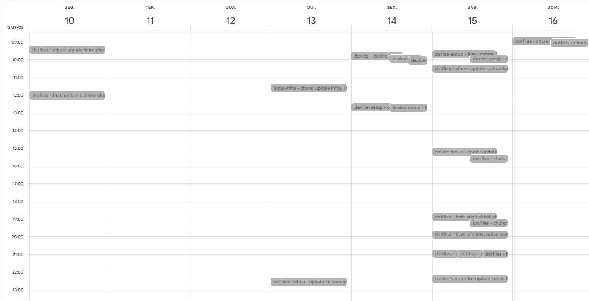

<a name="TOC"></a>

<h3 align="center">
  GCAL SYNC
</h3>

<div align="center">
  <a href="https://www.npmjs.com/package/gcal-sync"></a>
  <a href="https://nodejs.org/en/"></a>
  <a href="https://script.google.com/home"></a>
  <a href="https://github.com/lucasvtiradentes/gcal-sync#contributing"></a>
</div>

<p align="center">
  <a href="#dart-features">Features</a> • <a href="#warning-requirements">Requirements</a> • <a href="#bulb-usage">Usage</a> • <a href="#wrench-development">Development</a> • <a href="#books-about">About</a>
</p>

<details>
  <summary align="center"><span>see <b>table of content</b></span></summary>
  <p align="center">
    <ul>
      <li><a href="#trumpet-overview">Overview</a></li>
      <li><a href="#dart-features">Features</a></li>
      <li><a href="#question-motivation">Motivation</a></li>
      <li><a href="#warning-requirements">Requirements</a></li>
      <li>
        <a href="#bulb-usage">Usage</a>
        <ul>
          <li><a href="#installation">Installation</a></li>
          <li><a href="#general-tips">General tips</a></li>
          <li><a href="#updating">Updating</a></li>
          <li><a href="#uninstall">Uninstall</a></li>
        </ul>
      </li>
      <li>
        <a href="#wrench-development">Development</a>
        <ul>
          <li><a href="#development-setup">Development setup</a></li>
          <li><a href="#used-technologies">Used technologies</a></li>
        </ul>
      </li>
      <li>
        <a href="#books-about">About</a>
        <ul>
          <li><a href="#related">Related</a></li>
          <li><a href="#license">License</a></li>
          <li><a href="#feedback">Feedback</a></li>
        </ul>
      </li>
      <li>
        <a href="#family-community">Community</a>
        <ul>
          <li><a href="#contributing">Contributing</a></li>
          <li><a href="#feedback">Feedback</a></li>
        </ul>
      </li>
    </ul>
  </p>
</details>

<a href="#"></a>

## :trumpet: Overview

Add an one way synchronization from <a href="https://github.com/">github</a> commits to your <a href="https://calendar.google.com/">google calendar</a> and boost your time-tracking and productivity analysis.

<div align="center">
  
</div>

## :question: Motivation<a href="#TOC"></a>

This project was deeply inspired by <a href="https://github.com/derekantrican/GAS-ICS-Sync">this tool</a>, and my main reason for creating this was to track my progress over my completed ticktick tasks, moving them to another calendar, which was not possible in the mentioned project at the time. After some time I also thought it would be a good idea to add github commits sync to google calendar.

> [!NOTE]
> After TickTick finally introduced [two-way sync with Google Calendar](https://www.youtube.com/watch?v=Wr0ybMGlVz4), I decided to remove the one-way sync from gcal-sync. I believe it served its purpose well by providing a valuable solution for the community during the time when TickTick had not yet implemented this functionality, but moving forward it feels appropriate to transition to the built-in ticktick solution.

## :dart: Features<a href="#TOC"></a>

&nbsp;&nbsp;&nbsp;✔️ sync your github commits to google calendar;<br>
&nbsp;&nbsp;&nbsp;✔️ option to send a daily summary notification of what gcalsync has done throughout the day;<br>
&nbsp;&nbsp;&nbsp;✔️ you can add a url link to run the sync function manually whenever you want.<br>

## :warning: Requirements<a href="#TOC"></a>

The only thing you need to use this solution is a `gmail/google account`.

## :bulb: Usage<a href="#TOC"></a>

### How it works

It basically sets a function to run in [google apps scripts](https://script.google.com/home) to run at every 5 minutes, and this function is responsable for:

- sync your github commits to google calendar;
- send you optional emails about session. daily changes, errors and new versions.

### Installation

To effectively use this project, do the following steps:

<details>
  <summary>1 - create a Google Apps Scripts (GAS) project</summary>
  <div>
    <br>
    <p>Go to the <a href="">google apps script</a> and create a new project by clicking in the button showed in the next image.<br>
    It would be a good idea to rename the project to something like "gcal-sync".</p>
    <p align="center"></p>
  </div>
</details>

<details>
  <summary>2 - setup the gcal-sync on GAS</summary>
  <div>
    <br>
    <p>Click on the initial file, which is the <b>rectangle-1</b> on the image.</p>
    <p align="center"></p>
    <p>Replace the initial content present in the <b>rectangle-2</b> with the gcal-sync code provided bellow.</p>
    <blockquote>
      <p><span>⚠️ Warning</span><br>
       Remember to update the <code>configs</code> object according to your data and needs.</p>
    </blockquote>

<!-- <DYNFIELD:GAS_SETUP> -->
<pre>
function getConfigs() {
  const configs = {
    settings: {
      sync_function: 'sync',                // function name to run every x minutes
      timezone_offset_correction: 0,        // hour correction to match maybe a daylight saving difference (if you want the events 1 hour "before", then put -1)
      update_frequency: 5,                  // wait time between sync checks (must be multiple of 5: 10, 15, etc)
      skip_mode: false,                     // if set to true, it will skip every sync (useful for not messing up your data if any bug occurs repeatedly)
      per_day_emails: {
        time_to_send: '22:00',              // time to email the summary
        email_daily_summary: false,         // email all the actions done in the day on the above time
        email_new_gcal_sync_release: false, // check one time per day and email when a new gcal-sync version is released on the above time
      },
      per_sync_emails: {
        email_errors: false,                // email when some error occurs
        email_session: false                // email when any item was added, updated or removed from your gcal
      }
    },
    github_sync: {
      username: 'lucasvtiradentes',         // github username
      personal_token: '',                   // github token, required if you want to sync private repo commits
      commits_configs: {
        should_sync: true,                  // controls if the github commits sync should be done
        commits_calendar: 'gh_commits',     // google calendar to insert commits as events
        ignored_repos: ['github-assets'],   // ignored repositories string array: ['repo1', 'repo2']
        parse_commit_emojis: true           // parse string emojis (:tada:) to emojis (✨)
      }
    }
  };
  return configs
}

function getGcalSync(){

  let gcalSync;
  const configs = getConfigs()
  const useDevVersion = false

  if (useDevVersion){
    const GcalSync = getGcalSyncDev()
    gcalSync = new GcalSync(configs);
  } else {
    const version = "2.1.2"
    const gcalSyncContent = UrlFetchApp.fetch(`https://cdn.jsdelivr.net/npm/gcal-sync@2.1.2`).getContentText();
    eval(gcalSyncContent)
    gcalSync = new GcalSync(configs);
  }

  return gcalSync;
}

function install() {
  const gcalSync = getGcalSync();
  gcalSync.install();
}

function uninstall() {
  const gcalSync = getGcalSync();
  gcalSync.uninstall();
}

function sync(){
  const gcalSync = getGcalSync()

  try{
    console.log(gcalSync.sync())
  } catch(e){
    gcalSync.handleError(e)
  }
}

function doGet(reqParams) {
  const gcalSync = getGcalSync()

  const response = {
    sessionData: {},
    logs: [],
    error: null
  }

  try {
    response.sessionData = gcalSync.sync()
    response.logs = gcalSync.getSessionLogs()
  } catch (e){
    response.error = e
    gcalSync.handleError(e)
  }

  return ContentService.createTextOutput(JSON.stringify(response)).setMimeType(ContentService.MimeType.JSON)
}
</pre>
<!-- </DYNFIELD:GAS_SETUP> -->

  </div>
</details>

<details>
  <summary>3 - allow the required google permissions</summary>
  <div>
    <br>
    <p>Go to the project settings by clicking on the <b>first image rectangle</b>. After that, check the option to show the <code>appsscript.json</code> in our project, a file that manages the required google api access.</p>
    <div align="center">
      <table>
        <tr>
          <td width="400">
            
          </td>
          <td width="400">
            
          </td>
        </tr>
      </table>
    </div>
    <p>Go back to the project files, and replace the content present in the <code>appsscript.json</code> with the following code:</p>    <p align="center"></p>
<!-- <DYNFIELD:GAS_APPSSCRIPT> -->
<pre>
{
  "timeZone": "Etc/GMT",
  "dependencies": {
    "enabledAdvancedServices": [
      {
        "userSymbol": "Calendar",
        "serviceId": "calendar",
        "version": "v3"
      }
    ]
  },
  "oauthScopes": [
    "https://www.googleapis.com/auth/script.scriptapp",
    "https://www.googleapis.com/auth/script.external_request",
    "https://www.googleapis.com/auth/calendar",
    "https://www.googleapis.com/auth/tasks",
    "https://www.googleapis.com/auth/script.send_mail",
    "https://www.googleapis.com/auth/userinfo.email"
  ],
  "exceptionLogging": "STACKDRIVER",
  "runtimeVersion": "V8",
  "webapp": {
    "executeAs": "USER_DEPLOYING",
    "access": "ANYONE_ANONYMOUS"
  }
}
</pre>
<!-- </DYNFIELD:GAS_APPSSCRIPT> -->
  </div>
</details>

<details>
  <summary>4 - setup the gcal-sync to run automatically every x minutes</summary>
  <div>
    <br>
    <p>Just follow what the bellow image shows, which is to select the <code>install</code> function and run it.<br>
    After, a popup will appear asking your permission, and you'll have to accept it.</p>
    <p align="center"></p>
  </div>
</details>

<details>
  <summary>5 - deploy an api to manually run the sync function (optional)</summary>
  <div>
    <br>
    <p>It will allow you to sync whenever you go to a generated link.<br>
    Just do as the image shows.</p>
    <p align="center"></p>
  </div>
</details>

### General tips

- it is not necessary to generate a github token in order to sync commits, it is only required if you want to sync your contributions to private repos as well;

### Updating

To update your gcal-sync instance and use the latest features, you just need to change the `version` number in the `getGcalSync` function, as it is shown bellow:

<pre>
function getGcalSync(){
  // ...
  const version = "1.0.0" // update here to use the latest features
  const content = UrlFetchApp.fetch(`https://cdn.jsdelivr.net/npm/gcal-sync@${version}`).getContentText();
  // ...
}
</pre>

So if your instance is running at version "1.0.0" and the latest is "3.6.1", just replace those numbers in the `version` variable.

It is a good practice to go to the [dist folder](./dist/) everytime you update your instance to check if your files in GAS are the same as the new version; if they're not this may cause erros.

### Uninstall

If you want to receive the daily emails, just go to the GAS respective project in the header dropdown menu select the `uninstall` function and then click on the `Run` button. By doing that, the GAS trigger responsable for running everyday the function will be deleted.

## :wrench: Development<a href="#TOC"></a>

### Development setup

<details>
  <summary align="center">Instructions for development setup</summary>
  <div>
<br>
To setup this project in your computer, run the following commands:

```bash
# Clone this repository
$ git clone https://github.com/lucasvtiradentes/gcal-sync

# Go into the repository
$ cd gcal-sync

# Install dependencies
$ npm install
```

If you want to [contribute](./docs/CONTRIBUTING.md) to the project, fork the project, make the necessary changes, and to test your work on google apps scripts with do this:

1. run `npm run build` in order to generate the dist files. After that, create a new GAS file (ex: dev_gcal.gs) and paste the content of [gcalsync_dev](./dist/setup/gcalsync_dev.js) on this new GAS file.

2. after that, update the content of the <code>getGcalSync</code> as specified bellow:

```js
function getGcalSync() {
  // ...
  const useDevVersion = true; // set this to true to use your gcal-sync version

  if (useDevVersion) {
    const GcalSync = getGcalSyncDev(); // your work is here
  }
  // ...
}
```

now you can test your work really easy on production/GAS!

  </div>
</details>

### Used technologies

This project uses the following thechnologies:

<div align="center">
  <table>
    <tr>
      <th>Scope</th>
      <th>Subject</th>
      <th>Technologies</th>
    </tr>
    <tr>
      <td rowspan="1">Main</td>
      <td>Main</td>
      <td align="center">
        <a href="https://nodejs.org/"></a>
        <a href="https://www.typescriptlang.org/"></a>
      </td>
    </tr>
    <tr>
      <td rowspan="3">Setup</td>
      <td>Code linting</td>
      <td align="center">
        <a href="https://github.com/prettier/prettier"></a>
        <a href="https://github.com/eslint/eslint"></a>
      </td>
    </tr>
    <tr>
      <!-- <td rowspan="2">Setup</td> -->
      <td>Commit linting</td>
      <td align="center">
      <a target="_blank" href="https://github.com/conventional-changelog/commitlint"></a>
      <a target="_blank" href="https://github.com/commitizen/cz-cli"></a>
      <a href="https://gitmoji.dev"></a>
      </td>
    </tr>
    <tr>
      <!-- <td rowspan="2">Setup</td> -->
      <td>Other</td>
      <td align="center">
        <a href="https://editorconfig.org/"></a>
        <a target="_blank" href="https://github.com/typicode/husky"></a>
        <a target="_blank" href="https://github.com/okonet/lint-staged"></a>
      </td>
    </tr>
  </table>
</div>

<a href="#"></a>

## :books: About<a href="#TOC"></a>

## Related

- [online-ics](https://larrybolt.github.io/online-ics-feed-viewer/): online tool to view the content of ICS calendars;
- [gas-ics-sync](https://github.com/derekantrican/GAS-ICS-Sync): A Google Apps Script for syncing ICS/ICAL files faster than the current Google Calendar speed. This was my main inspiration;
- [esports-notifier](https://github.com/lucasvtiradentes/esports-notifier): get an daily email whenever one of your favorite eSports team has a match at day in games such as csgo, valorant and rainbow six siege;
- [twitch-notifier](https://github.com/lucasvtiradentes/twitch-notifier): get email notifications when _only your favorite_ twitch streamers go live.

## License

This project is distributed under the terms of the MIT License Version 2.0. A complete version of the license is available in the [LICENSE](LICENSE) file in this repository. Any contribution made to this project will be licensed under the MIT License Version 2.0.

<a href="#"></a>

<div align="center">
  <p>
    <a target="_blank" href="https://www.linkedin.com/in/lucasvtiradentes/"></a>
    <a target="_blank" href="mailto:lucasvtiradentes@gmail.com"></a>
  </p>
  <p>Made with ❤️ by <b>Lucas Vieira</b></p>
</div>
